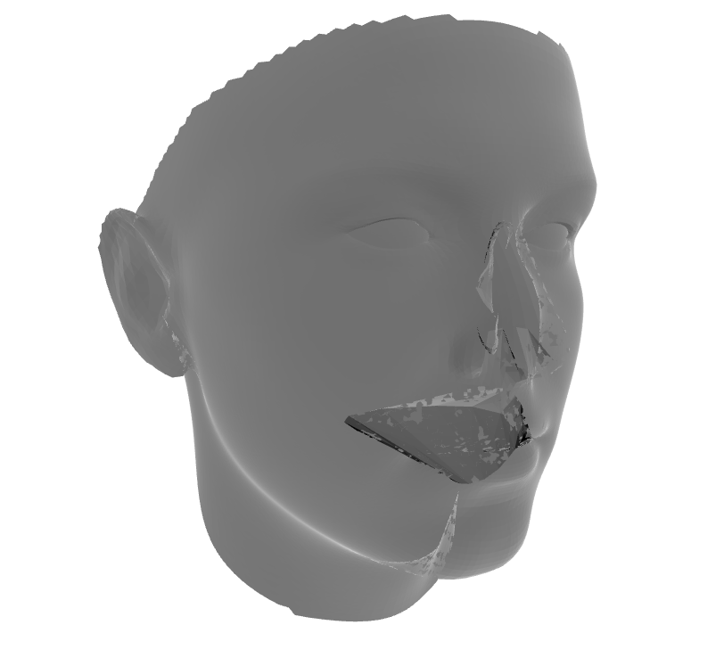

 # BFM viewer

A python starter tool for Basel Face Model

author: Jotaro Shigeyama

## requirements
- BFM .mat file from BFM website (https://faces.dmi.unibas.ch/bfm/)
- scipy, numpy, trimesh (you can `pip install` all of 'em).

## viewer

This repository contains python codes for learning how to handle BFM.

## references

[1] Paysan P.,Knothe R., Amberg B., Romdhani S., and Vetter T. A 3D Face Model for Pose and Illumination Invariant Face Recognition. IN: Proceedings of the 6th IEEE International Conference on Advanced Video and Signal based Surveillance (AVSS) for Security, Safety and Monitoring in Smart Environments Genova (Italy), pp 296 - 301, September, 2009